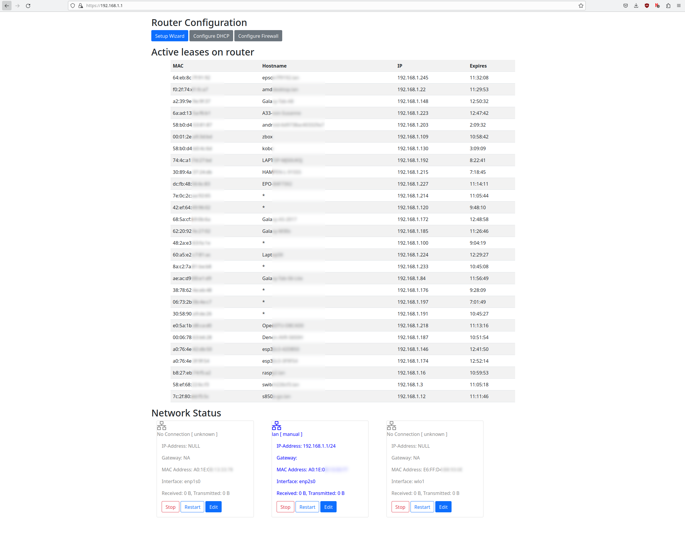

# What's this?
MPCRouter is a web-based administration tool to convert you Mini-/MicroPC
with at least 2 Ethernet ports into a Home-Router. It is installed on top of
any any standard Linux distribution (for Debian 12 packages are supported).
MPCRouter allows you to monitor and administrate the router remotely or
locally through a web-page. It aims to provide the following advantages over
router-specific distribuitons (e.g. OpenWRT):
- Very simple and guided installation: If you know how to install Debian
  and have basic networking knowledge you are good-to-go.
- Graphical install, no hardware fiddling needed
- In case of network misconfiguration, just use a local console for recovery
- Very high NAT performance (e.g. for Fiber to the Home or GBit routing)
- Standard Linux distribution in combination with moderately powerful router
  allows to install other services on the same machine using normal
  distribution packages

Tested on:
- MINIX NEO J51-C8 Max (512GB SSD, 8GB RAM, Intel Jasper Lake N5105, Dual
2.GBit Ethernet)
- ZBox CI331 nano (128GBit SSD, 4GB RAM, Intel Jasper Lake N5100, Dual
1GBit Ethernet)

Note that while it is not difficult to also provide a Wifi Access Point
throught the Wifi 5/6 adapters of these devices, setup will need to be done
manually at this point using hostapd and bridged LAN-side interface.

Note: This is BETA testing software, proceed with care!

# Installation
To install mpcrouter on your computer, first install all the runtime dependencies, then install:
```
$ sudo apt-get install mkcert libnss3-tools ruby-rack ruby-rack-ssl puma ruby-rubygems rubygems-integration ruby-sinatra
  ruby-sinatra-contrib nftables network-manager dnsmasq radvd
$ sudo gem install ruby-dbus
$ sudo make install
```

# Building Debian Packages
To build a debian package, first install all build dependencies, then make the deb-pkg target:
```
$ sudo apt-get install dh-make devscripts
$ sudo make deb-pkg
```

The debian package (under the build directory) can then simply be installed after
downloading it into the /tmp (important because of permissions for apt!)
directory (--fix-broken merely makes sure all dependencies are installed, too):
```
/tmp$ sudo apt install --fix-broken ./mpcrouter_0.1-1_all.deb
```

# Usage



