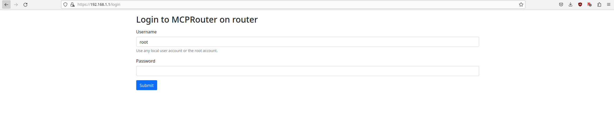
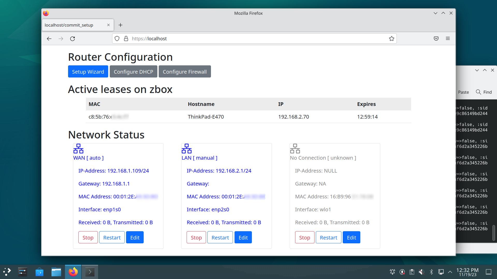
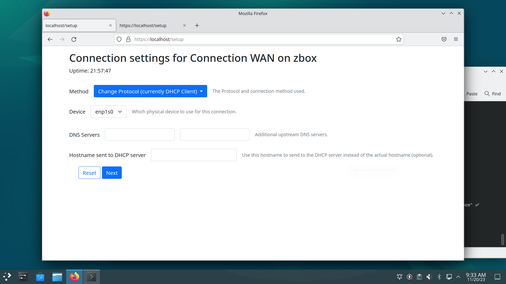
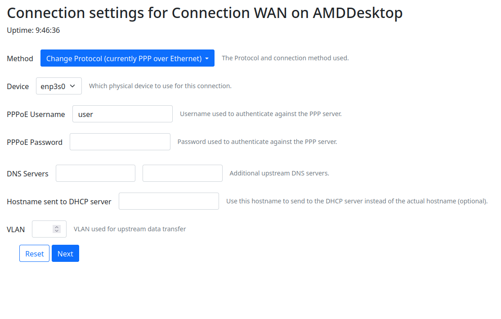
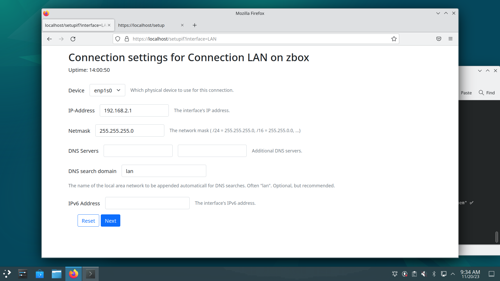
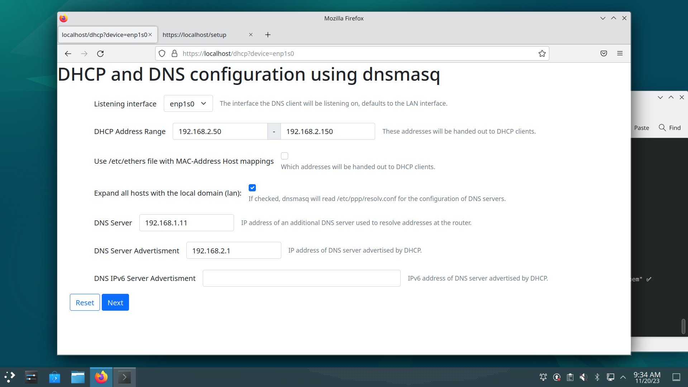
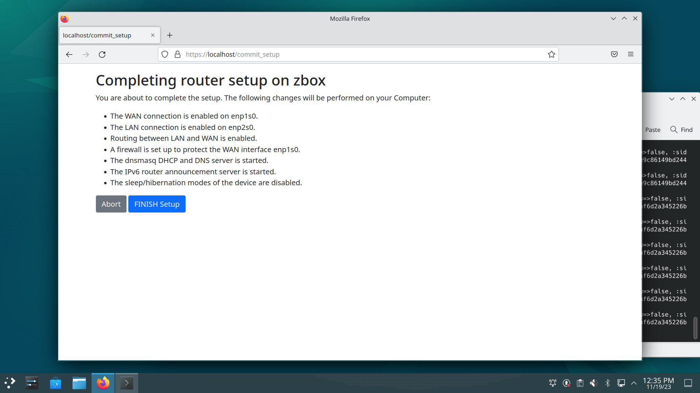
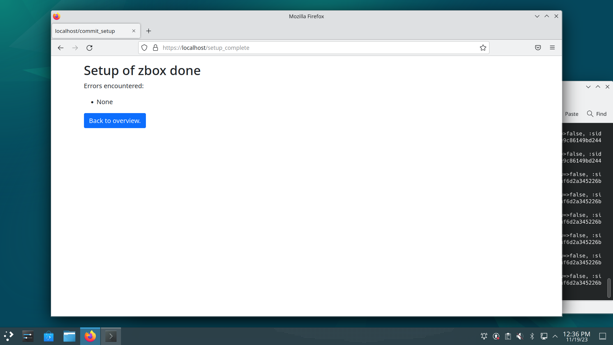
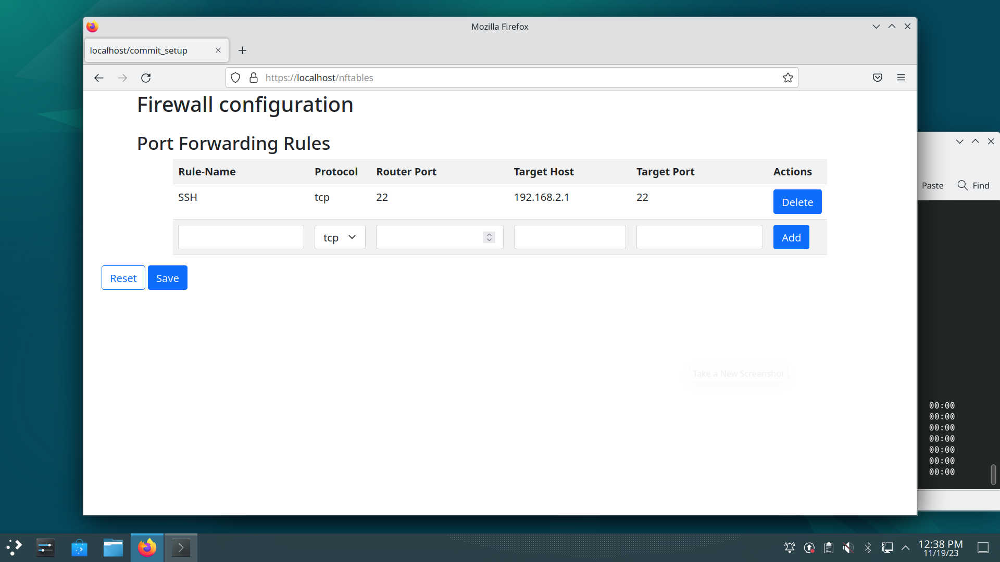

# What's this?
MPCRouter is a web-based administration tool to convert you Mini-/MicroPC
with at least 2 Ethernet ports into a Home-Router. It is installed on top of
any any standard Linux distribution (for Debian 12 packages are supported).
MPCRouter allows you to monitor and administrate the router remotely or
locally through a web-page. It aims to provide the following advantages over
router-specific distribuitons (e.g. OpenWRT):
- Very simple and guided installation: If you know how to install Debian
  and have basic networking knowledge you are good-to-go.
- Graphical install, no hardware fiddling needed
- In case of network misconfiguration, just use a local console for recovery
- Very high NAT performance (e.g. for Fiber to the Home or GBit routing)
- Standard Linux distribution in combination with moderately powerful router
  allows to install other services on the same machine using normal
  distribution packages

Tested on:
- MINIX NEO J51-C8 Max (512GB SSD, 8GB RAM, Intel Jasper Lake N5105, Dual
2.GBit Ethernet)
- ZBox CI331 nano (128GBit SSD, 4GB RAM, Intel Jasper Lake N5100, Dual
1GBit Ethernet)

Note that while it is not difficult to also provide a Wifi Access Point
throught the Wifi 5/6 adapters of these devices, setup will need to be done
manually at this point using hostapd and bridged LAN-side interface.

Note: This is BETA testing software, proceed with care!

# Installation
To install mpcrouter on your computer, first install all the runtime dependencies, then install:
```
$ sudo apt-get install mkcert libnss3-tools ruby-rack ruby-rack-ssl puma ruby-rubygems rubygems-integration ruby-sinatra
  ruby-sinatra-contrib nftables network-manager dnsmasq radvd
$ sudo gem install ruby-dbus
$ sudo make install
```

# Building Debian Packages
To build a debian package, first install all build dependencies, then make the deb-pkg target:
```
$ sudo apt-get install dh-make devscripts
$ sudo make deb-pkg
```

The debian package (under the build directory) can then simply be installed after
downloading it into the /tmp (important because of permissions for apt!)
directory (--fix-broken merely makes sure all dependencies are installed, too):
```
/tmp$ sudo apt install --fix-broken ./mpcrouter_0.1-1_all.deb
```

# Configuration
To configure the router, start a browser locally on that machine and connect via http or https to localhost:

In case you are using https, you will either need to make a security exception in the browser
or follow the instructions here: [[https://github.com/FiloSottile/mkcert]] to install the certificates
in the trust-store of the users browser. See the heading "Installing the CA on other systems" if you want
to access the secure page from other devices on your LAN without making a security exception. The
root-CA is installed by the installation scripts for the root user.

You can then log in with any local user and password. On the main page you will be able to start the setup
wizard:


Start the Wizard and you will first set up the WAN configuration:

You can choose between a fixed WAN IP address, assignement via DHCP (typical Fibre to the home provider)
and PPPoE (also with VLAN like for the DTAG), see below:


In the next step, the LAN-Side of the router is configured. This is static IP configuration where you have
to input the router's IP address and Network mask:


In the next step, the DHCP server and DNS setup for the LAN-side can be configured:


Note that until now no actual changes were performed on the router setup. An overview of the steps is given
now that they will be commited:


At the end you will get an overview of what may have failed:


# Firewall
A firewall is automatically installed. By clicking the "Configure Firewall" button, additionally port forwarding
can be configured:


